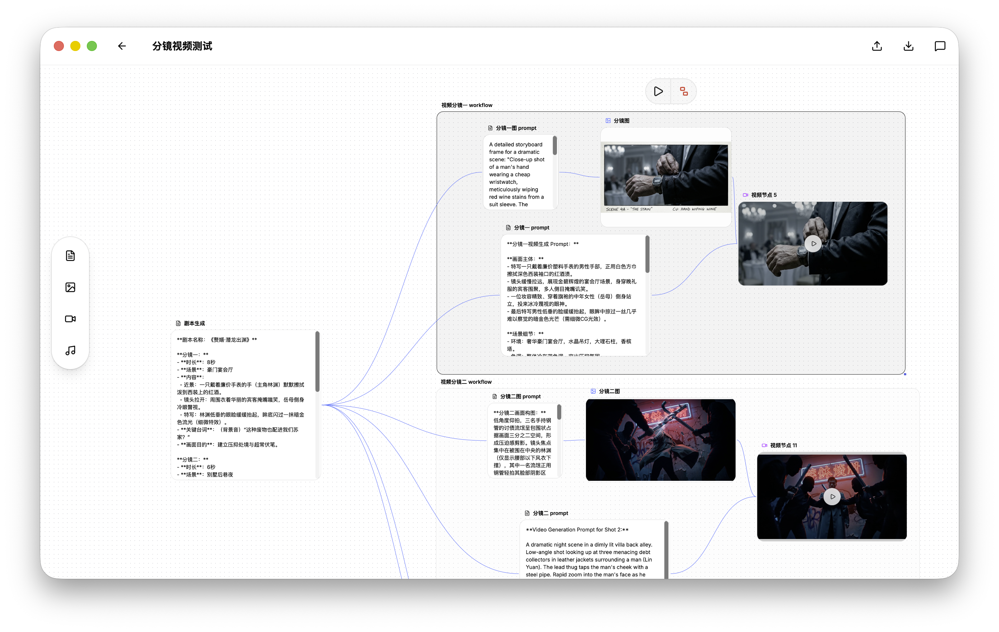
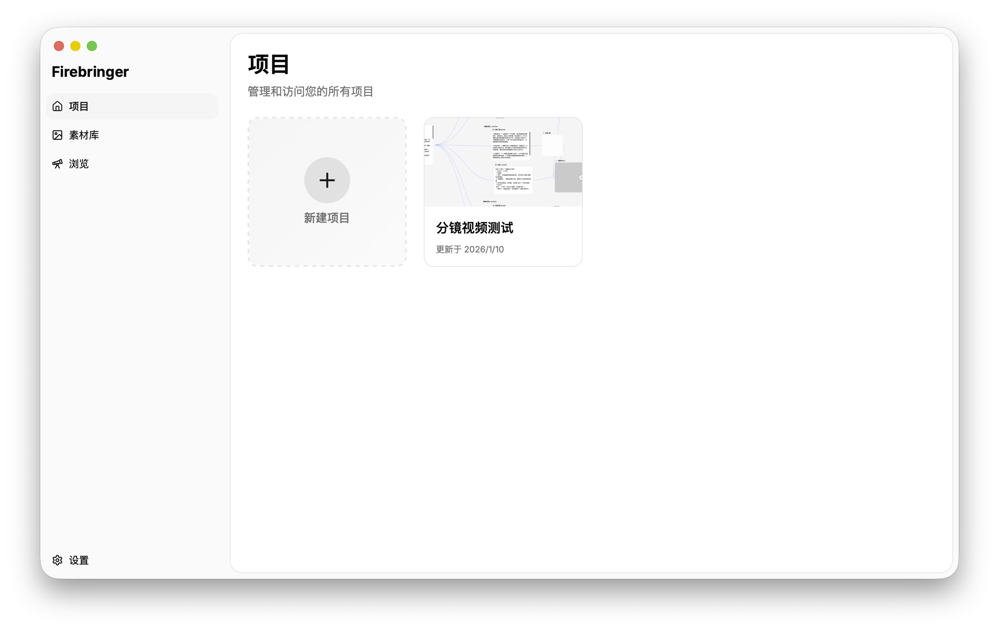
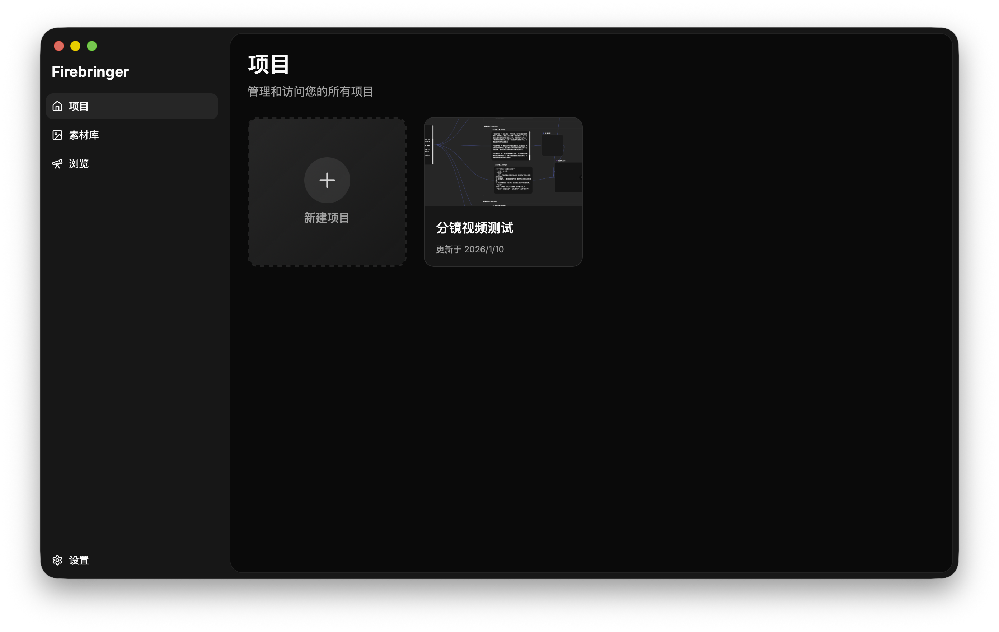

# VisioFlow

<div align="center">
  
  <p><strong>Node-based Visual AI Content Generation Workflow Editor</strong></p>
</div>

<div align="center">
  <a href="README.zh-CN.md">简体中文</a> | English
</div>

## ✨ Features

- **Visual Workflow Editor**: Drag-and-drop node editing interface powered by ReactFlow
- **Multimodal AI Support**: Generate text, images, videos, and audio content
- **Multiple AI Providers**: Integrated with OpenAI, Claude, and Gemini
- **Local Asset Management**: Built-in asset library with local file storage
- **Project Management**: Save, load, and manage multiple workflow projects
- **Multilingual Interface**: Built-in internationalization support 
- **Cross-Platform**: Native desktop app for macOS, Windows, and Linux

## 📸 Screenshots

<div align="center">
  
  <p><em>Visual Node-based Workflow Editor</em></p>
</div>


<div align="center">
  
  
  <p><em>Light and Dark Theme Support</em></p>
</div>


## 🛠️ Tech Stack

**Backend:**
- Go 1.24
- Wails v2 (Desktop App Framework)
- SQLite (sqlx + go-sqlite3)
- AI SDKs: anthropic-sdk-go, go-openai, google genai

**Frontend:**
- React 19 + TypeScript
- Vite 7 (Build Tool)
- ReactFlow (@xyflow/react) - Visual Canvas
- Tailwind CSS 4 - Styling
- shadcn/ui - UI Component Library
- Lingui - Internationalization (i18n)

## 🚀 Quick Start

### Requirements

- Go 1.24+
- Node.js 18+ and pnpm
- Wails CLI: `go install github.com/wailsapp/wails/v2/cmd/wails@latest`

### Installation

```bash
# Clone the repository
git clone https://github.com/yourusername/visionflow.git
cd visionflow

# Install frontend dependencies
cd frontend
pnpm install
cd ..
```

### Development

Run development mode with hot-reload:

```bash
wails dev
```

The application will start with:
- Main window with React app
- Development server at http://localhost:34115 (for testing Go methods in browser)
- Local file server at http://localhost:34116 (for generated assets)

### Build

Build production-ready installer:

```bash
wails build
```

Executable will be generated in `build/bin/` directory.

## 📖 Usage Guide

### Creating a Workflow

1. Create a new project from the sidebar
2. Add nodes to the canvas (Text, Image, Video, Audio)
3. Connect nodes by dragging from output to input handles
4. Configure AI provider and model for each node
5. Click "Run" to execute nodes and generate content
6. View generated assets in the asset library

### Node Types

- **Text Node**: Generate text content using LLMs
- **Image Node**: Generate images from text descriptions
- **Video Node**: Create videos from prompts
- **Audio Node**: Generate audio/speech content
- **Group Node**: Organize and group multiple nodes

### Connecting Nodes

Nodes can pass content to downstream nodes:
- Connect output handle of one node to input handle of another
- Source node's output becomes target node's input context
- Supports multiple input types (text, image, video, audio)

## 🔧 Configuration

### AI Provider Settings

1. Open Settings (gear icon)
2. Navigate to "Model Providers"
3. Add your API keys:
   - OpenAI (text, image generation)
   - Claude (text generation)
   - Gemini (text generation)

### Storage Locations

- **Database**: `~/Library/Application Support/visionflow/visionflow.db`
- **Generated Assets**: `~/Library/Application Support/visionflow/generated/`
- **Model Capabilities**: `~/Library/Application Support/visionflow/model_data.json`

## 💻 Development Guide

### Project Structure

```
visionflow/
├── main.go                 # Application entry point
├── binding/                # Wails bindings (exposed to frontend)
│   ├── ai/                # AI service bindings
│   └── database/          # Database service bindings
├── service/                # Core business logic
│   ├── ai/                # AI provider implementations
│   └── storage/           # File storage utilities
├── database/               # Data persistence layer
│   ├── models.go          # Data models
│   └── repository.go      # Database operations
└── frontend/               # React application
    ├── src/
    │   ├── components/    # UI components
    │   │   ├── nodes/     # Node implementations
    │   │   ├── settings/  # Settings dialogs
    │   │   └── ui/        # shadcn/ui components
    │   └── hooks/         # Custom React Hooks
    └── wailsjs/           # Auto-generated Wails bindings
```

### Adding a New AI Provider

1. Implement `AIClient` interface in `service/ai/{provider}.go`
2. Add provider case in `NewClient()` factory function (`service/ai/utils.go`)
3. Add provider constant in `database/models.go`
4. Update `model_data.json` with provider's models
5. Expose methods through `binding/ai/service.go`

### Key Development Patterns

- **Service Layer First**: Implement logic in `service/` first, then expose through `binding/`
- **Wails Bindings**: Never manually edit `frontend/wailsjs/go/` - they are auto-generated
- **Node Execution**: Use `useNodeRun` Hook with `runTrigger` UUID to manage state
- **Asset Access**: Frontend accesses generated files via `http://localhost:34116/{filename}`

## 🤝 Contributing

Contributions are welcome! Feel free to submit a Pull Request.

## 📄 License

This project is licensed under the PolyForm Noncommercial License 1.0.0 - see the [LICENSE](LICENSE) file for details.

This is a noncommercial license that allows personal use, research, and use by noncommercial organizations, but does not permit commercial use.

## 🙏 Acknowledgments

- [Wails](https://wails.io/) - Desktop application framework
- [ReactFlow](https://reactflow.dev/) - Node-based visual editor
- [shadcn/ui](https://ui.shadcn.com/) - UI component library

## 📞 Support

For issues and feature requests, please use the [GitHub Issues](https://github.com/miaomint/vision-flow/issues) page.
